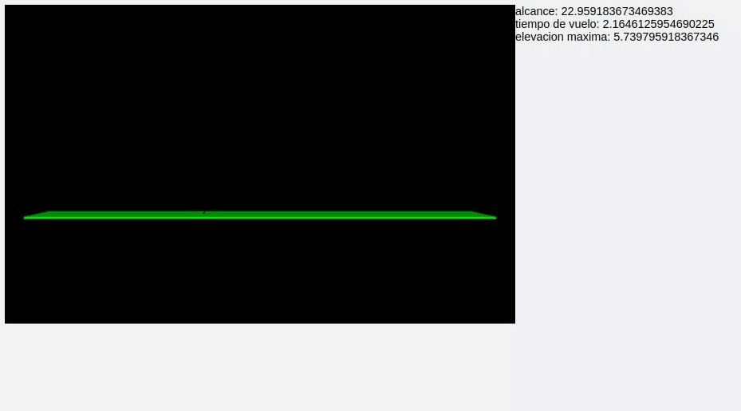

# Oblique Throw Simulation

An oblique throw physics simulation made on vpython, it helped me study and understand the movement of a particle given ecuations for X and Y.

## Usage can be seen by -h

```sh
usage: tiro_oblicuo.py [-h] start_height shot_speed shot_angle display

Get shift and/or speed data of an oblique shot simulation.

positional arguments:
  start_height  A starting height for the object.
  shot_speed    A speed given in a numeric value, for the object to be shot
                at.
  shot_angle    An angle given in degrees, for the object to be shot at.
  display       A bool, a web-browser animation will display if set to true.

options:
  -h, --help    show this help message and exit
```

## Execution example


